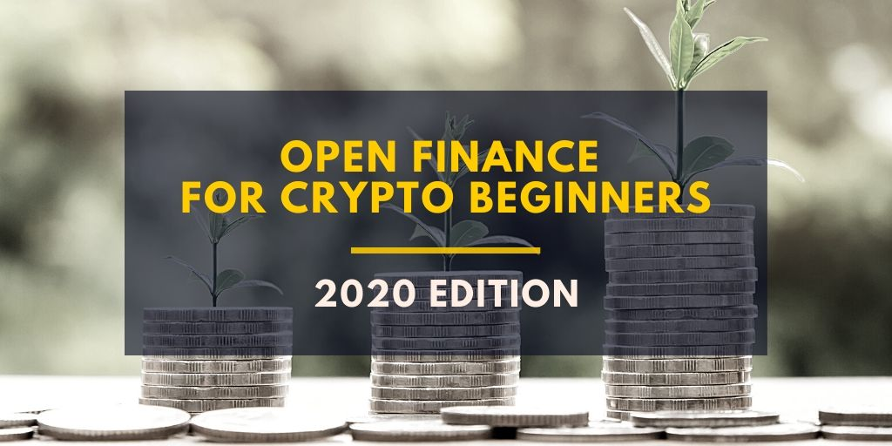
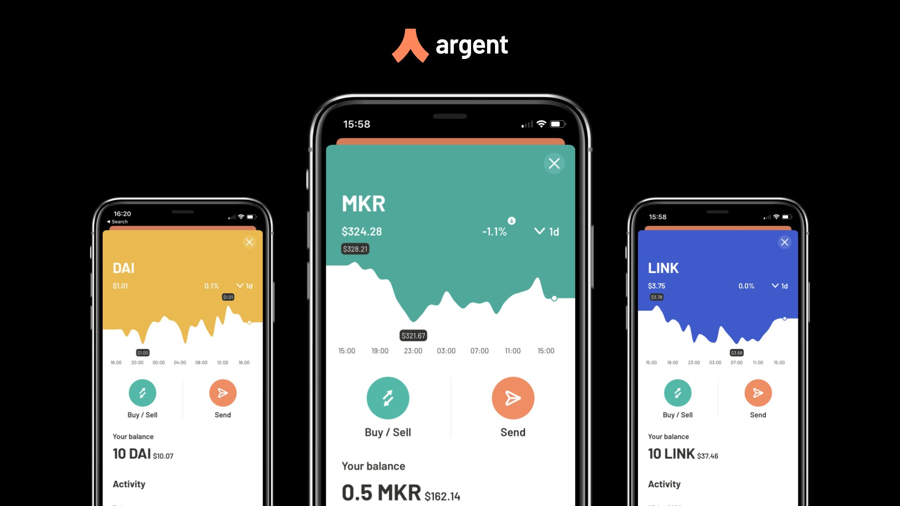
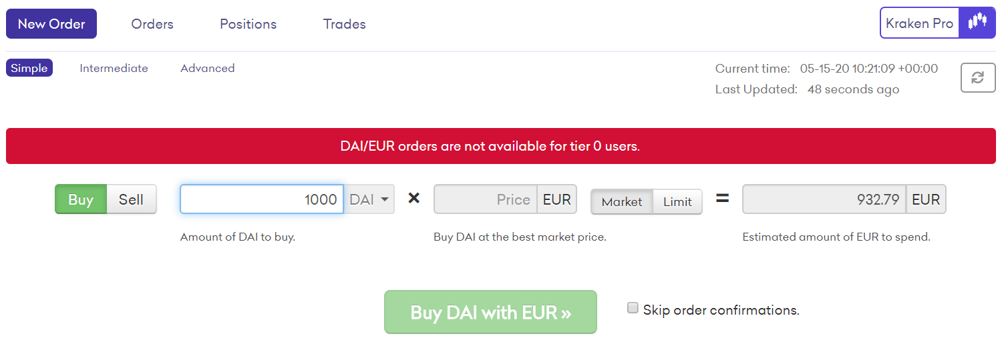
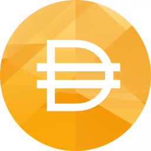
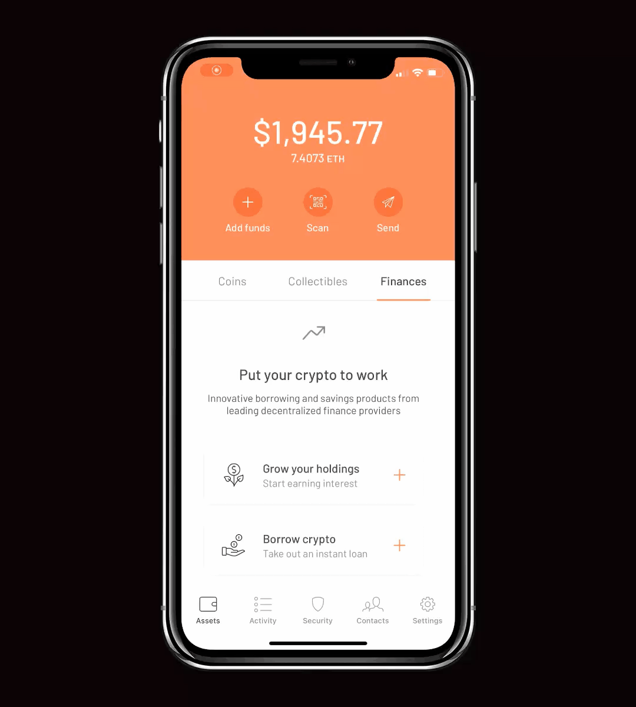
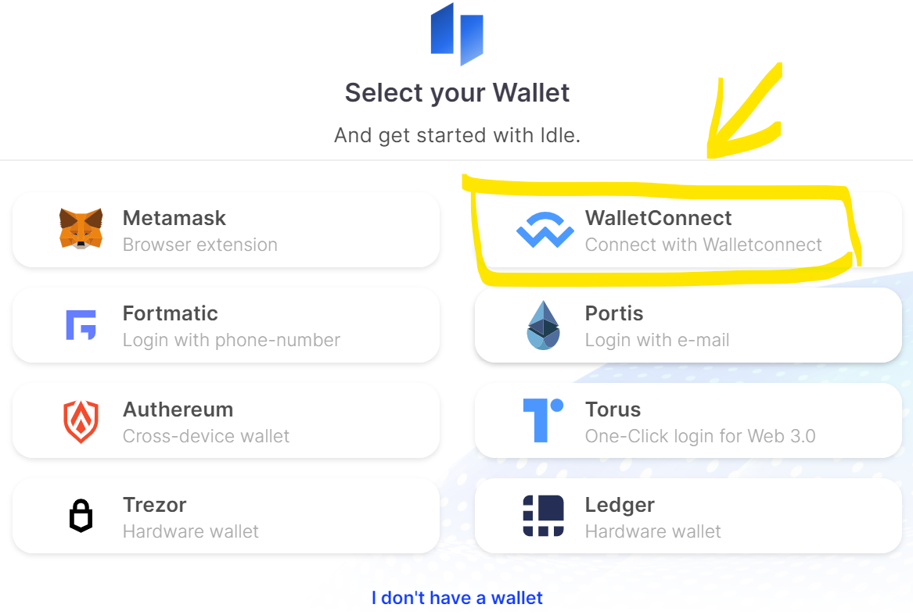

> This article is not financial advice. Always do your research and decide yourself what is best for you. You take all responsibility for your actions.

I’ve been researching open finance since its origins in early 2019. I’ve been reading, learning, testing, and using my own money to find a better solution for my personal finance.

**Open Finance** (also called Decentralized Finance or DeFi) is a name for rapidly developing movement in blockchain space that aims to replace banks, financial institutions, and other middlemen. I call them **traditional finance**. Open finance gives us, end-users, full control over our money. That also means that we have full responsibility as there is no institution to fix our mistakes.

I must put it straight here. If you lose access to your funds in your crypto wallet, no one can help you. If you accidentally send funds to the wrong recipient, there is no way to get them back. By using open finance products, you are exposed to risk. It’s rather low for popular products but you have to assess it yourself. Every product is different and introduces different risk levels.

**You are your own bank with all benefits but also with all responsibilities**. That sounded very exciting to me when I started. If you feel insecure right now, maybe you are just not ready yet. I hope you will feel more confident at the end of this read.

In this article I want to show everybody how to use open finance to your benefit, keeping it as familiar as possible with terms we know from traditional finance. It won’t be an easy ride, as entering the world of open finance currently requires a lot of prior knowledge and understanding of blockchain, cryptography, cryptocurrencies, and much more. I’m trying to keep it simple but I’m also skipping a lot of contexts. I encourage you to do your own learning and research. Never put your money in financial products you don’t understand.

## # The opportunity

Most people enter crypto space to speculate on the price of different digital currencies like Bitcoin. I think that is very dangerous for beginners. In this article I’m writing about relatively safe ways to put your money to work using open finance products, so you will find nothing about speculation here.

**Open finance offers better interest-earning opportunities for your money than traditional banking**. The simplest financial product that we all know is saving account. In Germany, where I live, it’s common that banks offer saving accounts with 0.01% APY (Annual Percentage Yield). Another option for your money are deposits, which at best can give you around 0.9% APY, but you have to lock your funds for 1 year or longer.

From the other side, in open finance, you can find products that offer deposits with 0.5–10% APY. The yield is variable as it is directly set by market dynamics. The average is still around 4% APY. Another cool thing is that **interests are paid every second and you can withdraw any time you want without losing your earnings**. I’m sure you can smell the advantage here.

_Earning interests on your cryptocurrency deposit_

There are many financial products available in open finance and new ones are released often. Some of them are based on the concepts we know from traditional banking, like deposits or loans. Some are entirely new, revolutionary, and not even possible in traditional finance. Advanced products will be reviewed in my future articles.

## # Blockchains & Cryptocurrencies

We start with learning about available blockchains and cryptocurrencies on the market. You can think about blockchain as a globally distributed, publicly accessible database. Let’s see which ones are good candidates to replace the traditional financial system. Based on the popular cryptocurrency analytics website [CoinMarketCap](https://coinmarketcap.com/) only two blockchains dominate the space: **Bitcoin and Ethereum**.

**Bitcoin** is the first and most secure blockchain out there but the utility of its native currency **BTC** is very limited. You can hold it, transfer it, and most people just speculate on its price. The total amount of BTC in circulation is limited and that’s why many people compare it to digital gold. It is a good store of value as long as enough people believe in it and are willing to pay for it. From my point of view, it has very little use in the future of open finance. As with gold, you can just hold it or speculate on it. It doesn’t pay dividends. BTC price is extremely volatile. You won’t use it for everyday payments because of that. There are ways to use BTC in open finance but that’s too complicated for beginner level.

The second most popular blockchain is **Ethereum**, with its base currency **ETH**. It offers one important feature that Bitcoin doesn’t. It’s called Smart Contracts. They enable the creation of new financial products and that’s why I think Ethereum is the only currently viable platform for open finance.

With smart contracts, programmers can create different tokens. The popular token standard is ERC-20 and you will see it mentioned in many crypto wallets. Tokens are basic building blocks for many Ethereum applications. They can have many different purposes.

The most important type of tokens used in open finance is called stable-coins. **Stable-coins** solve the cryptocurrency price volatility problem. They are pegged to value of some other asset, like USD dollar or gold. They are 1:1 crypto equivalent of fiat currencies we use every day. Status quo in 2020 is that all popular stable coins are pegged to USD. Examples are **DAI, USDT, USDC**. We will use stable-coins as a safe way to hold our crypto funds.

## # Crypto wallets

A first step to becoming your own bank is to get a crypto wallet. A crypto wallet is an application for your smartphone or computer. It lets you access and manage your digital assets. It doesn’t hold your money as a physical wallet does. Cryptocurrencies are not stored on your device. Instead, they are always stored on a blockchain. **A crypto wallet is your gateway to a blockchain**. It generates your personal account address where you can receive funds. It also holds a special cryptographic key that gives you full control over your account. Only the holder of that key can manage the account. That’s why it is crucial not to share it with others. The key is always stored on your device only. Once again, a crypto wallet doesn’t hold your coins, but it holds the cryptographic key to manage your coins stored on a blockchain.

There are different types of crypto wallets offered by many companies and individuals. I found a list of around 150 crypto wallets available today. Which one shall a crypto beginner start with? They all are free, most of them offering a very similar, basic set of features. The truth is, most of them cannot be used with open finance.

As for today, **I think the most beginner-friendly Ethereum crypto wallet is [Argent](https://www.argent.xyz/)**. It is a mobile app available in both the App Store and Google Play Store. With Argent you don’t have to worry (so much) about losing access to your funds. It also gives you direct access to a few selected open finance products with an option to connect your wallet to many more applications. Argent has just publicly launched a few days ago after many months in limited access beta-tests period. So go and grab it while it is still warm and fresh.

**Your first exercise is to set up an Argent crypto wallet on your phone**. I’m not going to write a detailed tutorial here but I’m sure you can figure it out yourself.

Let’s recap. So far we have an empty crypto wallet and we know that stable coins are a good way to keep our money on a blockchain. In the next chapter, we will talk about how to exchange our [fiat money](https://en.wikipedia.org/wiki/Fiat_money) to crypto money. I think that is the hardest step to enter open finance, so stay with me.

## # Getting cryptocurrencies

To enter open finance we need to buy a cryptocurrency and pay with our local currency. There are different regulations around the world, so what I’m describing here might not work for you. You need to find a way to obtain cryptocurrency that is possible in your country.

Based on knowledge from previous chapters, we want to deposit our funds into stable-coin like DAI. One important note here: DAI is considered a stable coin but its value is slightly volatile. It oscillates around 1 USD but it can be worth also 1.02 USD or 0.98 USD. Let’s say that market determines the price here. From a positive side, it is truly decentralized, even if you might not fully understand the benefits of that yet.

Many companies sell cryptocurrencies. They usually charge very high fees (from 1% to even 5%) and almost always require you to confirm your identity. That’s why I think **this is the most painful step of the journey to open finance**. After that the rest is easy.

You can pay with a credit card or bank transfer. Using a credit card is the most expensive option to buy cryptocurrencies. Fees are around 5%. Remember, we are entering the world of open finance to find better earning opportunities for our savings. By paying with a credit card we lose 5% right at the start. This is a terrible choice, so stay away from it.

Paying with bank transfer with a 1–1.5% fee is probably the most reasonable and accessible option for most of us. But be aware, that even with future earnings of an average 6% APY on crypto saving account, the first 2 months your money work only to pay back the 1% fee you paid.

**The cheapest option** with fees in the range of 0.2–0.5% is to open an account on a professional cryptocurrency exchange like Coinbase Pro, Kraken, or Binance. The user interface there might be overwhelming at first but you can find many tutorials online to help you with that. You need to find an exchange where you can trade DAI for your local currency like USD or EUR. So if you live in Europe, you can, for example, find DAI/EUR pair traded on Kraken. Always be aware of how much fees you have to pay. Some exchanges also charge a withdrawal fee. You want to withdraw DAI to your Argent wallet right after the purchase to use it with open finance products.

_A simple way to buy DAI on Kraken_

We know now a little bit more about buying cryptocurrencies. Most crypto wallets allow you to buy crypto with fiat money too. That is a good way for wallet creators to make money.

Let’s review the offer of our crypto wallet Argent. Inside the app, you can see the “Add funds” button. Then, depending on your country of residence, you can see different purchase options. You can also tap “View limits” to read about the requirements and limits on the bottom of a page. Check that as it’s interesting. Argent allows you to buy crypto worth up to 50 EUR with just basic personal information. That sounds like the easiest way to take your first step into crypto space. You can research other options later when you get comfortable with crypto and open finance.

_symbol of DAI stable-coin_

**Your next task is to get hold of some DAI and transfer them to your Argent wallet**. It’s up to you where and how you buy them. A fast, easy, but expensive way is to buy DAI directly in Argent with your credit card. A slower but cheaper way is to use Argent but pay with bank transfer if available. The cheapest option is to open a trading account on a cryptocurrency exchange like Kraken, verify your identity, transfer money there, swap to DAI, and send DAI to your Argent wallet.

I told you, this step is the worst one as you lose the most money here and identity verification can take some time. As **exchanging local currency to cryptocurrency is an expensive process**, you should avoid it as much as possible. The same applies the other way around. Don’t use funds you will need to spend in a few months. When transferring your crypto savings back to local currency, you will pay around a 1% fee again. At best, just start with a very small amount as your play money.

## # Putting cryptocurrency to work

Argent offers a few open finance products right inside the app. It lets you open a saving account with Compound, Aave, or Dai Savings (also called Maker). For now, it’s enough to understand that they are just different saving products with their own rules behind. Let’s also ignore other DeFi products available in the latest version of the Argent wallet. We will come back to them in the next article.

The interest rate of the saving accounts changes often so just pick the offer that is currently best for you. As Argent currently doesn’t display APY for all saving products inside the app, you can check them on a website like [DeFi Rate](https://defirate.com/lend/). You can deposit your DAI in a few finger taps, as shown in the video below. The withdrawal process is also very accessible and fast.

That looks easy, doesn’t it? That is the magic of open finance. It’s your money and you don’t have to ask your bank for permission to use them. You don’t need to wait weeks to open another account or days for money transfer to process.

**Transactions on Ethereum usually take a few minutes before they are processed and accepted on the blockchain. They are not free.** Every transaction spends a small amount of native cryptocurrency ETH. You are lucky if you use the Argent wallet as it covers the transaction costs for you. But if you want to use Argent with external applications, you need to get a little bit of ETH to pay for transactions yourself. You can easily swap DAI for ETH inside the Argent app or buy some ETH separately.

A few open finance products inside Argent are just a small sample of the possibilities available. One of the reasons I recommended you Argent as your crypto wallet is **a feature to connect with external applications using a method called WalletConnect**. Let’s see how does it work on an example below.

[Idle](https://idle.finance/) is a more advanced saving account that offers to maximize your lending returns. It builds on top of other saving accounts and **automatically moves your funds to the one that offers the best interest rate**. Isn’t that awesome? That is an excellent example of a financial product not possible in traditional banking.

To use Idle with Argent, you need first to connect your wallet using WalletConnect.

-   Open [Idle](https://idle.finance/) website. Make sure that you are on [https://idle.finance/](https://idle.finance/#/).
-   Click “Start with Best-Yield”
-   Click the “Connect” button and then select “WalletConnect”, like on the screen below. You will be presented with a QR code.
-   Then open your Argent wallet, tap “Scan”, and scan the QR code.

That’s it! Notice that **you didn’t have to create a new user account** on Idle. You didn’t type any username or password. Your crypto wallet is your account to the new Internet that I’m so excited about.

Unfortunately, Argent won’t pay for transactions with Idle, so we need to get some ETH in our wallet. Around 10 USD worth of ETH is enough for now. Then just follow steps on Idle website to start saving with Idle.

There is one more important thing to explain here. When depositing your DAI to Idle, you receive back idleDAI tokens. Their amount will be different from the amount of DAI you used but don’t worry about it. You can always see the current amount of your savings on the Idle website after connecting your wallet. idleDAI is a token like any other ERC-20 token. You will see them on the Argent coins list together with other assets you are holding. It won’t appear in Argent’s Finances tab as Idle is not natively integrated with Argent. As long as you keep these tokens you will be able to claim your DAI back together with interests they earned.

Ok, that was a short introduction to advanced open finance products, but I want to leave them for a separate article. I think it’s enough of new knowledge to absorb for now.

**Your last task for today is to deposit your DAI to one of the saving accounts offered by Argent**. Check the next day how much money you will have already earned.

If you feel more adventurous, try this instead:

-   Get some ETH; you can easily buy it for 10 DAI from your Argent wallet
-   Put half of your remaining DAI to one of Argent saving accounts
-   Connect to Idle website and deposit the rest of your DAI there
-   Come back in a few days and compare which saving account is performing better

You just took a few first steps to the freedom and independence of open finance. I hope this article will make you feel more comfortable with managing your own funds on blockchain and encourage you to do your own research to find better financial products for you.

## # Final thoughts

We are very early in the process of cryptocurrency adoption. I’m looking forward to the future where I will receive my salary in DAI and pay for everything directly from a crypto wallet on my smartphone. In that future, we don’t have to wait up to 3 days for a money transfer but it happens in a few minutes. A blockchain with smart contracts, like Ethereum, enables many more improvements over traditional finance, most we cannot even imagine yet. But we can become the pioneers of open finance already today.

My name is Kris Urbas and I’m a software engineer. I used to help companies build their internet products. That was web 2.0. Now I’m spending most of my time researching web 3.0. I’m happy to share my insights with you. **The next generation of the Internet is coming and will affect all of us**. I believe the customers will win this time, and corporations will have to adapt or extinct.

If you like this read, give it a like and [follow me on Twitter](https://twitter.com/krzysu). Also, feel free to share your experience with open finance. I’m curious about your opinion.
