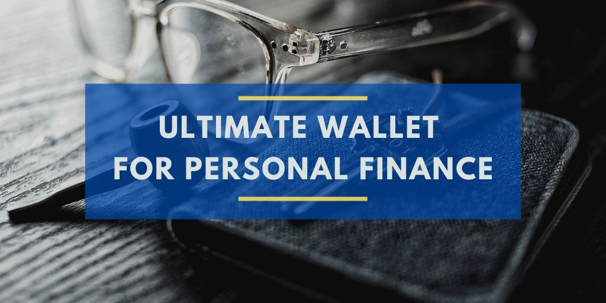

I’m presenting my concept for an ultimate cryptocurrency wallet. **Its most prominent feature is to hide the complexity of a blockchain and cryptocurrency from a user**. It is designed to replicate traditional activities around the everyday use of money and allow for a seamless transition from a bank account into a non-custodial digital account for your personal finance.

This concept has been growing in my head for a while now. Initially, I thought about replacing traditional banks with new crypto bank built on a blockchain. Then I realized that **the role of a bank is no longer needed in the new open financial system**. That role was taken over by protocols. Smart contracts are capable of providing the same functionality as a traditional bank, but they are more efficient at it.

This article is not intended to be a product specification. There are still some open questions to answer and decisions to make. This concept requires many experiments and iterations to nail down the customer needs as well as the business model behind it.** The goal is to provide a better solution for personal finance than any traditional bank can deliver**. That will lead to the mass adoption of open finance.

Every currently available cryptocurrency wallet requires some prior technical knowledge from users. I would argue that most of them are not beginner-friendly. We don’t need another wallet to store hundreds of different cryptocurrencies. We need one wallet that offers features familiar to traditional banking, one that is **accessible to our friends and family.**

All technologies and protocols are already out there, but no one has yet connected them all in the ultimate user experience for personal finance. With new financial products, we should also **promote good practices for personal money management**, that interestingly no institution in the traditional finance cares about.

## Features

My concept for the ultimate non-custodial wallet assumes:

-   An Ethereum smart contract wallet that allows for multiple address creation
-   The base currency is a super stable coin
-   Wallet opening process is similar to traditional bank account opening
-   Multiple wallet recovery options
-   Features named similar like in a traditional bank account for easier user adoption
-   Multiple checking accounts (addresses) with different purposes, also optionally some of them connected to a debit card for easy spending
-   Multiple saving accounts with different goals and saving strategies, with automatic yield optimization
-   Set of default features of a traditional bank, like direct debit, subscriptions, notifications, and user-defined alerts
-   Contact book including trusted addresses with different security requirements
-   Full transaction history for each address, easy for audits and tax reports
-   Transaction costs transparent in local currency or subsidized by the wallet provider
-   Advanced investment options like trading cryptocurrencies (yes, buying ETC is for advanced users and is clearly explained as speculation)
-   Optional — Tools for simple, user-defined automated tasks, like “transfer 20% of income from salary address to spending address” or “every 30 days put 100 USD to my retirement saving plan”
-   Optional — Simple web3 identity management

## Details

Remember that the ultimate wallet concept aims individuals to help them better manage their personal finance. Small and medium businesses have different needs and would require a different set of features. Let me explain a bit more on a few selected points.

### Base currency

The base currency of all addresses in the wallet is USD dollar. It is represented by super stable coin like [mUSD](https://www.mstable.org/) or any other basket of digital USD coins. This way, the wallet users are not exposed to the risk of any single stable coin currently available. It also keeps users familiar with the currency they use every day.

I would not offer wallets in other fiat currencies as long as their digital equivalents are not available or popular enough. **Users must see the same balance of their accounts every day**. The wallet cannot just show the account value based on the exchange rate to USD.

### Multiple addresses

Hierarchical Deterministic Wallets allow for a creation of multiple addresses from a single master seed phrase. That would let users to easily create new addresses for different purposes, like multiple checking and saving accounts. Status messaging app is already doing that, [read more here](https://our.status.im/what-is-status-multi-account/).

### Wallet creation and recovery

The onboarding process should be very familiar with opening an account in a traditional bank. Creating a new wallet could look like:

-   Register with your email only
-   Verify ID
-   Transfer initial funds from your regular bank to your new ultimate wallet
-   There are no on-ramp fees (wallet provider pays them), or account opening costs a small fixed fee
-   There is no loss of value of your funds; if you transfer 100 USD, you have 100 digital USD in your wallet

There are many options for account recovery and 2FA. I’m still not sure which one is the best:

-   12 words seed phrase (like Gnosis Safe)
-   login + 6 digit PIN (like Pepo)
-   Guardians (like Argent)
-   Another device (like Keybase)
-   Or just different combinations of device + email + SMS

### Checking accounts

Each of us needs at least one checking account. The primary usage is to receive a salary from work and to spend money while shopping. But keeping all your money in one account is not a good practice. For better accounting and a general overview of your finance, it is better to have a few checking accounts for different purposes. It should be straightforward for a user to create a new account and give it a name.

Optionally, a bit more advanced user should be able to define rules and automate the money flow. Imagine a user has a salary account, that automatically sends 20% of income to their spending account connected to a debit card. That makes spending easy and exposes only a fraction of user funds in case of a card being stolen or hacked.

Debit card connected to a spending account represented in digital fiat currency doesn’t inquire any additional exchange fees. **Ultimate wallet must be cheaper to use than a traditional bank account**. Currently, that is not the case with any crypto debit card on the market.

### Saving accounts

Users should be able to create as many saving accounts as they want with different goals, like retirement, vacation, education, etc. Optionally users should be able to define saving strategy, like monthly deposits, or keep a fraction of each transaction. New users should not care if their money is deposited in a Compound or Aave protocol. Instead, **they must always receive the best yield rate**. Luckily there are already products offering that, like [Idle](https://idle.finance/) or [The Robo Advisor for Yield](https://staking.staked.us/ray).

### Centralized features

The ultimate wallet is a non-custodial product, so the wallet provider can never spend user funds. From the other side, I don’t think building a fully decentralized product will help with mass adoption. **Users don’t seem to care much about decentralization, putting more value into convenience**. The wallet has to provide the best user experience and accessibility. Users should not even be aware that there is a blockchain behind the product.

Having said so, I believe many complementary features like address book, alerts, and notifications should be built using centralized databases maintained by wallet provider.

### Advanced features

Trading cryptocurrencies is a risky activity. The purpose of the ultimate wallet is to improve personal finance. I want people to use it every day. It’s not about getting rich fast. That’s why I would offer buying and holding ETH and other ERC-20 tokens as an advanced feature with a clear explanation of the risks involved. As a wallet provider, **we don’t want our clients to lose money**.

Other advanced features could be providing liquidity to DeFi protocols like Uniswap or Curve, or investing in TokenSets. Advanced users are also allowed to use any open finance product using WalletConnect.

### Optional identity management

Another significant feature provided by the ultimate wallet could be identity management. In the future, a user could use separate identities for different activities, like online shopping or gaming. As the ultimate wallet is a non-custodial product, the provider requests just the minimum required data to offer the product. A user can withdraw access to their data any time, terminating the agreement with the provider about wallet services. Of course, the user is always the only owner of their funds.

## Business model

Finally, let’s see how the company behind the ultimate wallet can stay sustainable. A non-custodial, blockchain-based product already has low maintenance costs, comparing to running a traditional bank. **The wallet fee structure should be or entirely hidden on the protocol level, or simple and fully transparent to the client.**

Potential sources of revenue on the protocol level could be:

-   Provision from any money-earning activity, like percentage of interest earned on saving accounts
-   Fees from trading activity
-   Income from gas optimization (using Gas Tokens)

Fully transparent and easy to understand fee structure could include:

-   Fixed monthly fee
-   A different set of features per product tier
-   Debit card issuance and annual fees
-   Insurance

I believe this is just scratching the surface of possible monetization methods for a company behind a user-friendly wallet for everybody.

## This is just a concept

I believe all features I included in this article are possible to implement today. Unfortunately, I don’t have enough smart contract development experience to do it myself. **I would be happy to be a part of a team making the ultimate wallet happen**. I’m open to suggestions and for a good discussion. Let’s build it together.

My name is Kris Urbas and I’m a software engineer. I used to help companies build their internet products. That was web 2.0. Now I’m spending most of my time researching web 3.0.

If you like this read give it a like and [follow me on Twitter](https://twitter.com/krzysu). Also, feel free to share your experience with open finance. I’m curious about your opinion.
