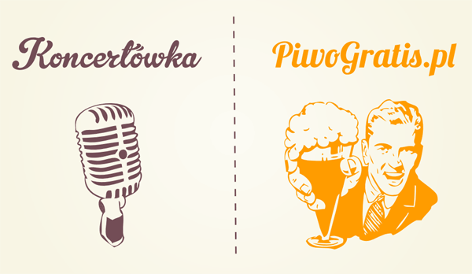

Mam dziś dzień wolny, na odpoczynek po intensywnym weekendzie w  Poznaniu, więc chciałbym podzielić się moimi przemyśleniami i wrażeniami  po tej bardzo ciekawej imprezie.

Wiele dobrego można się tam  nauczyć (**bardzo intensywnie**), poznać różnych ludzi z różnymi pomysłami, a  także zobaczyć jak wygląda świat związanych z prowadzeniem biznesu **w  polskim Internecie**, przynajmniej tzw. mainsteamu.

I ten mainstream  właśnie średnio mi się spodobało. Zbyt wiele było tam "**napinki**" (ze  słownika wspinaczy górskich, ale nie przychodzi mi do głowy bardziej  celne określenie), ale w **negatywnym** sensie. Większość "doświadczonych"  (mam tu na myśli mentorów, organizatorów, jury i innych) zaraz po  prezentacji pomysłu, kazało nam liczyć pieniądze, dopinać model  biznesowy, szukać klientów, wymieniać źródła przychodów. Ok, nie można  temu nie **przyznać racji**, ale dlaczego tak umniejsza się rolę rozwinięcia  tego pomysłu w kierunku bardziej "ideologicznym" (nie wiem czy to dobre  słowo)? Przecież moim pomysłem **nie jest**:  dopięcie modelu biznesowego, zarobienie grubej kasy czy posiadanie  wielu klientów biznesowych. Mój (w sensie twórcy czegokolwiek) pomysł to  rozwiązanie jakiś ludzkich problemów, sprawienie aby żyło nam się  lepiej, aby świat był piękniejszy :), no i żebyśmy mieli z tej pracy trochę fun'u!. I według mnie to tu pojawia się  problem jak te dwa interesy pogodzić. **Aby robiąc świat lepszy innym,  uczynić go także lepszym dla siebie...** Czyli wracając już do biznesu,  aby każdy na tym zarobił.

Nie podam tutaj uniwersalnego  rozwiązania, ale zaraz opiszę, jak to rozwiązaliśmy w naszym przypadku  (czyli projektu **koncertówka.pl**). Przypominam tylko, że uczynienie  użytkownika twojego biznesu **szczęśliwym** jest długą drogą, ale na bazie  takich użytkowników możesz zbudować już prawie każdy biznes, jeżeli  oczywiście będziesz to szczęście **podtrzymywać**.

Wielkim plusem tej  imprezy jest możliwość znalezienia ludzi do współpracy. **Zgrany team to  podstawa w tym biznesie**. Nasza praca w Poznaniu zaczęła się od idei  (teraz obdzierając ją z pięknych słów) stworzenia serwisu ze  spersonalizowanymi informacjami o koncertach we Wrocławiu, który posiada  wyczerpującą bazę danych. Czyli: jesteś we Wrocławiu i myślisz  "koncert!", to kolejną Twoją myślą jest: "Wejdę na koncertówkę i zobaczę  co mi na dziś proponują". I wiesz, że jak u nas nie ma tego wydarzenia  muzycznego, to ono się nie odbywa.

Okazało się oczywiście, że model  biznesowy się nie domyka, bo **próg wejścia** na ten rynek jest **za wysoki**.  Chodzi o to, że potrzeba od razu mieć pełną bazę danych, czyli umowy z  każdym klubem muzycznym, barem czy innym organizatorem eventów we  Wrocławiu. Natomiast, aby ich w pełni pozyskać (a tylko to spełniałoby  nasze założenia projektu), trzeba znów mieć kartę przetargową w postaci  bazy użytkowników, czego też nie mieliśmy.

Z tego problemu zrodził  się projekt **piwogratis.pl**, który ma dużo prostsze założenia, jednak on  domyka się biznesowo bez problemu. Przynajmniej nadal w to wierzymy :)  Według mnie dowodem na to może być** brak pytań** na koniec naszej  prezentacji w Poznaniu! Brak pytań? Sami nie mogliśmy w to uwierzyć.

Nie zdradzę tutaj jednak jak działa piwogratis.pl, ale postaram się informować o postępach.

Podsumowując imprezę w Poznaniu:

- brawa za klimat i organizację (przynajmniej ja bym tego lepiej nie zrobił),
- cieszę się, że poznałem tyle osób z którymi można pogadać na poziomie i wiele się od nich nauczyć,
- okazuje się, że jak się wierzy w swój projekt, to można **pracować 16h non-stop** bez zmęczenia :)

A moim zwycięzcą w Startup Weekend Poznań jest projekt **Starlight**, chłopaki super pomysł!
