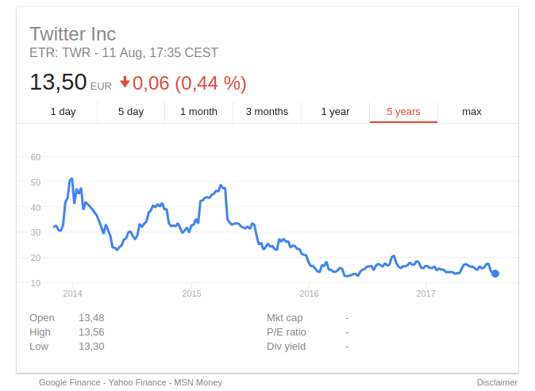

> With great power comes great responsibility!

Oto część druga mojego cyklu o problemach branży IT. [W części pierwszej](/co-mnie-boli-w-it-management/) napisałem o słabych managerach, którzy nie znają swojej roli w procesie tworzenia oprogramowania. Rezultatem tego jest marna jakość systemu i produktu, niewykorzystywanie potencjału zespołu technicznego oraz brak satysfakcji z wykonywanej pracy.

Dzisiaj spojrzymy na nasz zawód z dalszej perspektywy. Rozwój technologiczny postępuje niesamowicie szybko. My jako inżynierowie, znający te technologie, możemy wykorzystać naszą wiedzę i umiejętności na wiele różnych sposobów. Spójrzmy na możliwe odpowiedzialności, które są z tym związane.

#### 1. Odpowiedzialność na poziomie organizacji

Organizacja (albo firma) ma zawsze jakiś cel. Najczęściej jest to, po prostu, zarabianie pieniędzy. Według amerykańskiego prawa **głównym i jedynym** zadaniem korporacji jest zwiększanie wartości dla jej udziałowców i inwestorów (!). Z drugiej strony firma oferuje produkt, który rozwiązuje jakiś z problemów ich klientów. W dziedzinie firm i startupów internetowych, produktem jest najczęściej aplikacja web'owa albo mobilna. I teraz pojawia się pytanie: czy na pewno nasz produkt rozwiązuje problem naszych użytkowników w najlepszy możliwy sposób? Czy może służy on tylko firmie w bogaceniu się? Oczywiście, najlepiej w przypadku, gdy oba punkty są spełnione: nasz produkt dostarcza wartość klientom, oni są zadowoleni i płacą nam pieniądze. My wykorzystujemy fundusze na dalsze usprawnienia produktu i koło się kręci. **Sytuacja *win-win***.

Jest jednak wiele firm, głównie startupów, które nie dbają o nic więcej niż wycenę własnej wartości dla inwestorów. **Idą na skróty, łamiąc prawo i narażając użytkowników na straty**. Kierują się wskaźnikami, które tak naprawę nie pokazują żadnej wartości (jak na przykład [liczba dostarczonych posiłków](https://medium.com/startup-foundation-stories/rocket-internet-a-detailed-look-da4302e887e4), zamiast ilość zamówień). Liczby są jednak wystarczająco duże, żeby przyciągnąć jeszcze więcej kapitału. W ten sposób powstaje bańka, która prędzej, czy później pęka. Taka rozdmuchana firma wchodzi czasem na giełdę papierów wartościowych, powodując jeszcze większe szkody. Wyobraź sobie, że zainwestowałeś swoje ciężko odłożone pieniądze w akcje firmy Twitter w 2014 roku. Ile są one teraz warte? Zainwestowałeś w firmę, która **nigdy nie była dochodowa, a jest wyceniona na miliardy dolarów**.

Mamy więc tutaj **brak odpowiedzialności organizacji wobec klientów, użytkowników i inwestorów**. Takie nieodpowiedzialne działanie wpływa też bardzo na pracowników, ale o tym już w kolejnym punkcie.

#### 2. Odpowiedzialność na poziomie managementu.

Mamy start-up, któremu bardzo zależy, żeby podbić rynek. Załóżmy, że jest to internetowy sklep z meblami. Model biznesowy ma sens, sprzedajemy towar za pieniądze. Mamy system internetowy, w którym przechowujemy dane adresowe naszych klientów, historie zamówień, ich preferencje, może nawet dane płatnicze. Powiedzmy, że mamy zespół technologiczny złożony z 80 osób, które pochodzą z całego świata. Oczywiście firma jest dużo większa, ale ograniczamy się w tej analizie tylko do IT. Zastanówmy się teraz, jak wielka odpowiedzialność spoczywa w rękach ludzi zarządzających tą firmą:
- odpowiedzialność wobec **klientów**: ich dane muszą być bezpieczne, a zamówienia muszą być realizowane.
- odpowiedzialność wobec **pracowników**: wielu z nich przyjechało z dalekich krajów, przeprowadziło się z rodzinami, żeby realizować misję firmy. Inwestują oni swój czas i swoje umiejętności w budowanie tego, co zarząd od nich oczekuje. **Nie marnujmy ich pracy**.
- odpowiedzialność wobec **inwestorów**: powierzyli oni nam swoje pieniądze, więc powinniśmy dysponować nimi rozsądnie.

A jak to często wygląda w praktyce?
- oprogramowanie jest rozwijane na szybko i chaotycznie. Prowadzi to do wielu błędów, słabego *User Experience* oraz całkiem możliwie, **do wycieku prywatnych danych użytkowników**. Dobre praktyki tworzenia oprogramowania są pomijane, bo management nie rozumie ich znaczenia.
- management tworzy nierealistyczne oczekiwania i presje wobec swoich pracowników. Prowadzi to **do stresu, utraty zdrowia, powszechnego niezadowolenia**. Osoby zarządzające nie rozumieją, że wypoczęci, zadowoleni i zmotywowani pracownicy osiągną dużo więcej.
- brak długoterminowej strategii sprawia, że pracownicy są, albo masowo zatrudniani, albo zwalniani. Co czuje osoba, która dla firmy przeprowadziła się z całą rodziną na drugi koniec świata, tylko po to, aby po pół roku dowiedzieć się, że **nie jest już potrzebna?**
- projekty są realizowane przez miesiące albo nawet lata, a następnie uśmiercane, bo **nigdy, tak naprawdę, nie było na nie zapotrzebowania**,
- pieniądze są marnowane, np. na nieużywane licencje albo nadmierną liczbę serwerów, które są potrzebne, aby uciągnąć naszą niewydajną aplikację.

To jest wszystko wynikiem **braku odpowiedzialności** wśród ludzi na różnych szczeblach zarządzania.  

#### 3. Odpowiedzialność osobista, czyli co Ty możesz zrobić!

W końcu dochodzimy do tego, co my, zwykli, szarzy inżynierowie, możemy zrobić z tymi wszystkimi powyższymi problemami. Zobaczmy, **co oznacza odpowiedzialność w zawodzie programisty**. Po pierwsze powinniśmy mieć własną etykę zawodową. Na przykład:
- wykonujemy naszą pracę najlepiej jak potrafimy,
- staramy się zostawiać kod w lepszej kondycji, niż go zastaliśmy,
- pamiętamy, że użytkownicy naszego systemu są najważniejsi,
- dostarczamy rozwiązania najlepsze dla naszych klientów.

Co za tym idzie, powinniśmy być w stanie powiedzieć ***nie*** w sytuacjach, gdy jesteśmy proszeni o zrobienie czegoś nieodpowiedniego.
- manager naciska, aby kosztem bezpieczeństwa danych użytkowników ukończyć projekt w krótszym terminie? -> **Nie!**
- podczas planowania słyszysz, że testy jednostkowe napiszemy kiedyś, później? -> **Nie!**
- zarząd chce, abyś pracował przy nowym produkcie, którego celem jest tylko wyciągnięcie pieniędzy z naiwnych klientów? -> **Nie!**

Jesteśmy inżynierami, w naszych rękach mamy nieograniczone możliwości tworzenia internetowych produktów, używajmy technologii z głową. Nie pracujmy dla firm, które nie dbają o pracowników, o środowisko, o użytkowników. Wybierajmy nasze projekty i miejsca zatrudnienia świadomie, nie tylko na podstawie wysokości wynagrodzenia. Bądźmy profesjonalistami i bądźmy odpowiedzialni za nasze działania!

Podziel się ze mną swoją opinią. Znajdziesz mnie w serwisie [Twitter](http://twitter.com/krzysu).
